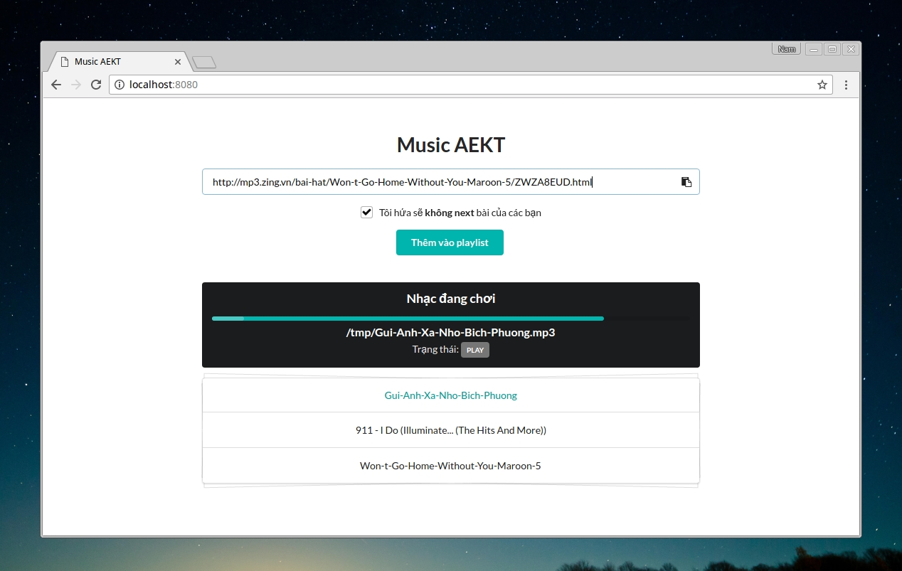

music-aekt (Music Anh Em Kĩ Thuật)
==================================



Support source
==============
Only support music in MP3 Zing at the momment

Require
=======

* [Music on console(MOC)](https://moc.daper.net)
* Python/Flask
* Celery 
* Redis (broker)

How to install (Ubuntu/Debian)
==============================

```
$ sudo apt-get install moc redis-server
$ pip install -r requirements.txt
```

Run
===
1, Music on console
```
$ mocp -S
```

2, Redis
```
# service redis-server start
```

3, Celery
```
$ celery worker -A music_aekt.tasks -c 1 --loglevel=info
```

4, HTTP Server
```
$ gunicorn wsgi:app config.py -w 2 -b 0.0.0.0:8080
```

Contributors
============
* [Dang Tung Lam](https://github.com/tunglam14/)

